# Mind Flora

Mind Flora is a site for encouraging users to reap the myriad health benefits of spending time in nature. The site’s main section highlights popular outdoor destinations across the UK, based on the categories of Mountains, Coasts, Lakes and Forests. These posts can be commented on by logged in users, thus providing a platform for conversation amongst the site registered users.

In the form section at the bottom of the page, users have the facility to share their own favourite outdoor destinations. The ultimate aim of this website is to create a community-driven content site for promoting the benefits of connecting with nature and the positive impact it has on mental well-being. 

The live link can be found here - [Mind Flora](https://ci-mind-flora-django-project-1988a394bde7.herokuapp.com/)

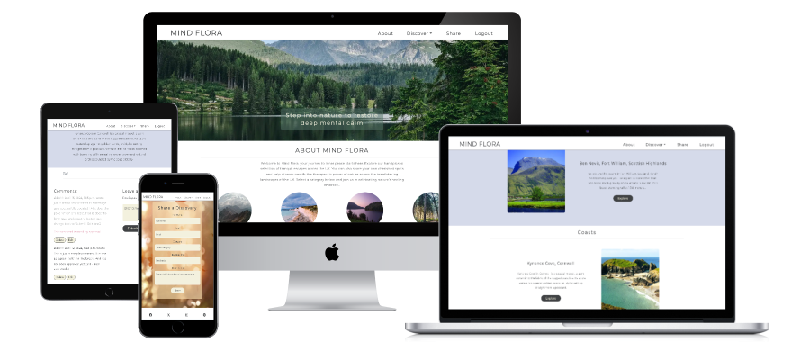

[Image Source - Website Mockup Generator](https://websitemockupgenerator.com/)

## Site Owner Goals

- To promote and encourage users to connect with nature in the UK with a particular focus on benefits for mental wellbeing.
- To promote a sense of community by allowing for users to share their own recommended nature spots. Thereby using user-driven content to promote the site's overall aim of improving mental wellbeing.
- To present a user-centric, mobile-first website that is intuitive to use and navigate. And one which is fully responsive across a range of different device screen sizes.
- To use a colour theme and visual appeal that is aligned with the site's core purpose of fostering a sense of calm and mental relaxation.

## User Stories/Goals

The website's features were scoped and built with the primary aim to meet the following user story requirements:   

- As a site user I can view a list of travel destination posts so that I can browse the collection and select which post I want to view in further detail
- As a Site User I can click on a post so that I can read it in full detail
- As a Site User / Admin I can view comments on an individual post so that I can read the conversation
- As a Site User I can register an account so that I can join the conversation by commenting on a post
- As a Site User I can modify or delete my comment on a post so that I can correct any errors or withdraw a comment from the conversation
- As a Site Admin I can approve/disapprove comments so that I can filter out comments that I do not want on the site
- As a Site User I can share a recommended travel destination, via a form, so that I can suggest content for the site.
- As a Site Admin I can access/view messages sent by site users, stored in a database, so that I can review them
- As a Site admin I can mark user messages as "read" so that I can see how many are still left to review

## Design

The website's use of color. fonts and imagery is essential to providing the user with a positive emotional experience while using the website. The image-driven approach and the use of a subtle purple color across various sections of the page promote a sense of calm and relaxation and ties in with the overall theme of the website to promote nature for mental well-being. In addition to this, the font style - Montserrat - imported via [Google Fonts](https://fonts.google.com/), along with appropriate using of letter spacing and line-height properties gives the site a non cluttered appearance which is pleasing to the eye and promotes relaxation.

## Wireframes

Low-fi wireframes were created using the Blasamiq wireframing tool.

 

    
Landing page (Desktop/mobile)

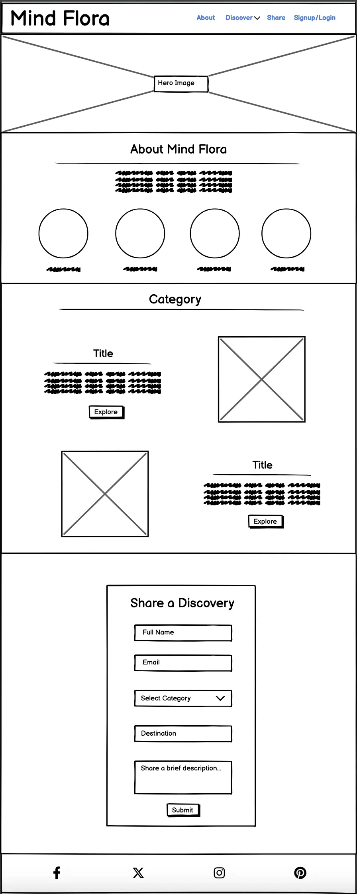
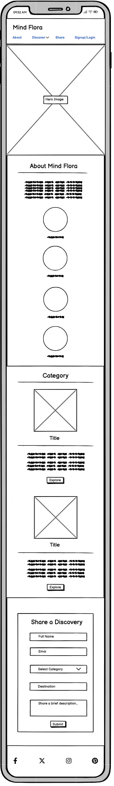

 

 

 
Post details page (Desktop/mobile)

 
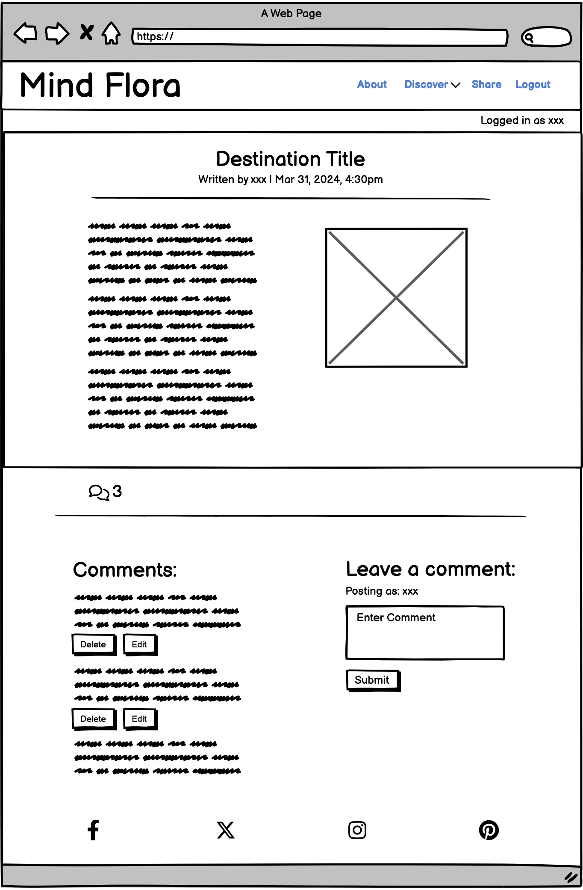
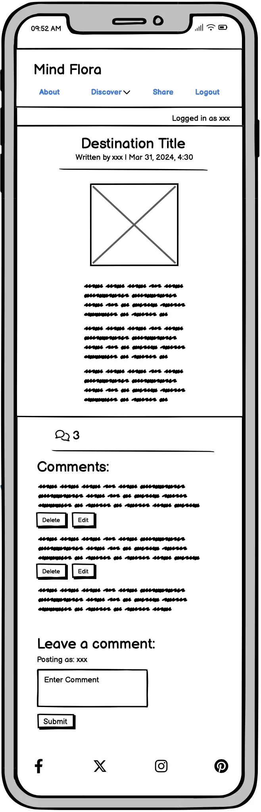

 

## Agile Methodology

Github projects was used to manage and gauge the progress during development of the app using an agile approach. The link to the project board can be found [here](https://github.com/users/kun-shukla/projects/3)

A Github Issue was created for each User Story. Each User Story was further drilled down into a set of acceptance criteria which helped to inform what features the app should incorporate. 

## Data Model

Django's class-based Models have been used to develop the database schema.

The following Entity Relationship Diagram (ERD) illustrates the schema.

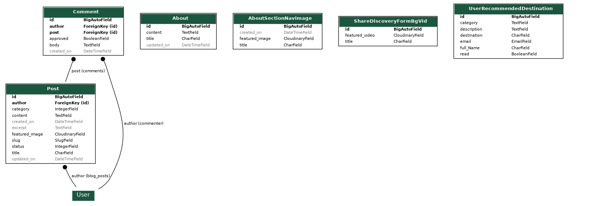

## Features

### Navigation

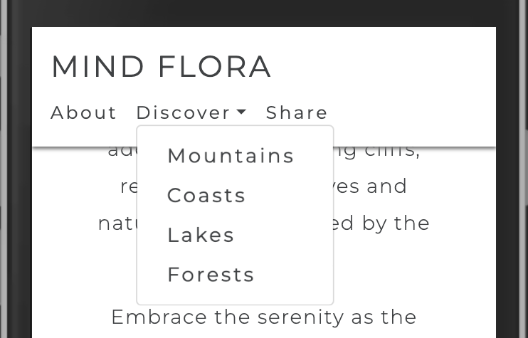

- The navigation bar is fully responsive and has links to the 'About', 'Discover' and 'Share' sections of the web page.
- A design decision was made not to incorporate a 'burger' menu for mobile screens as this would mean an extra 'tap' to get to a particular link. Having said that I am aware there is a trade off here, as an advantage of having a drop down burger menu is that it optimises the use of screen 'real estate'.
- The logo 'Mind Flora' serves as the 'Home' link and takes the user back to the top when they are browsing other sections of the page. The idea behind coming up with this name for the website was to marry its 2 main areas of focus - mental wellbeing (Mind) and the connection it has with being out in nature (Flora). It is also a play on the term 'gut flora' and how keeping it in balance is important for overall wellbeing.
- The 'Discover' nav link has a drop-down toggle which, on pressing, opens up a sub-menu that contains links for each of the 4 content categories i.e. Mountains, Coasts, Lakes and Forests.
- The navbar is set to fixed so that, as the user scrolls further down the page, it remains visible at all times.This provides for an optimised navigation experience as the user does not have to manually scroll to the top of the page/use the browser back button. Furthermore a drop shadow effect is applied so that there is clear distinction between the navbar and content being viewed.

### Hero Image Section

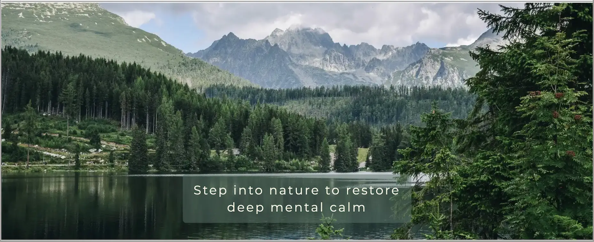

- This section has an alluring image of a landscape with a short text overlay to provide users with an immediate impression of the site's theme.
- The overlay text is placed deliberately to give it a good contrast against the darker background.

### About Section

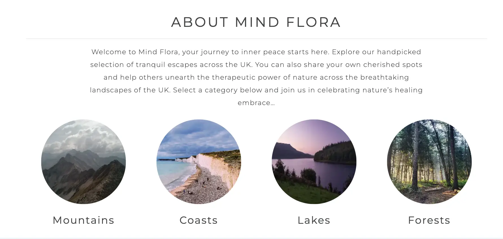

- The About Section provides a snapshot of the purpose/utility of the website.

- The user is then led on to a visually appealing representation of the four main content categories in the form of circular image links which further lead to the respective content section. The text below each of the images are also clickable.

- The design of this section is aimed at enticing users to explore the other sections of the web page by providing an enhanced, image-driven means of navigation

- The image links are fully responsive and change layout/size according to screen size to maintain a positive visual impression.

### Categories Content Section

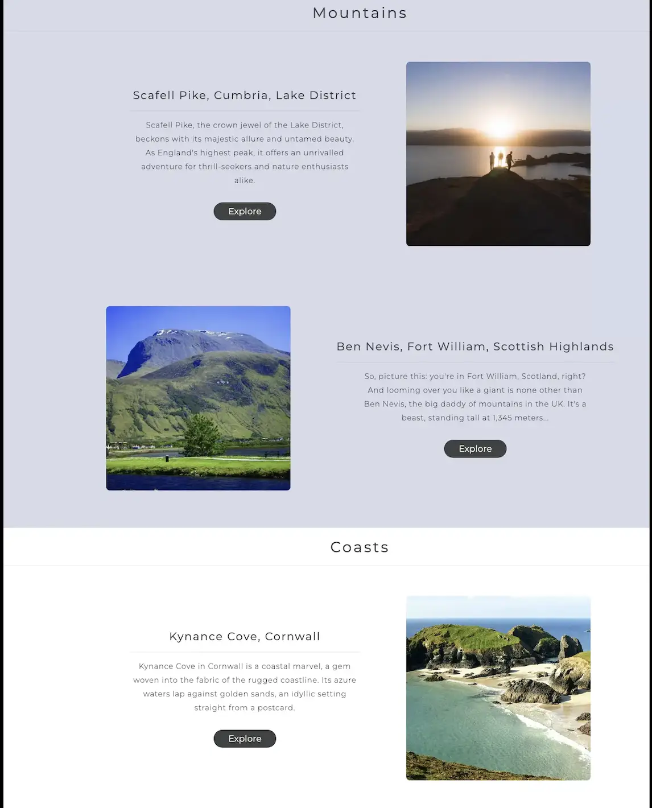

- This section contains content relating to each of the four nature categories i.e. - Mountains, Coasts, Lakes and Forests.
- Each category has one recommended place to visit. The aim is to continually expand the content of this section both through curated as well as user generated content via a 'Share a Discovery' form section
- The alternating background colors provide a pleasing look and feel to this section. It is fully responsive and reduces to a single column layout for mobile screens.

### 'Share a Discovery' Form Section

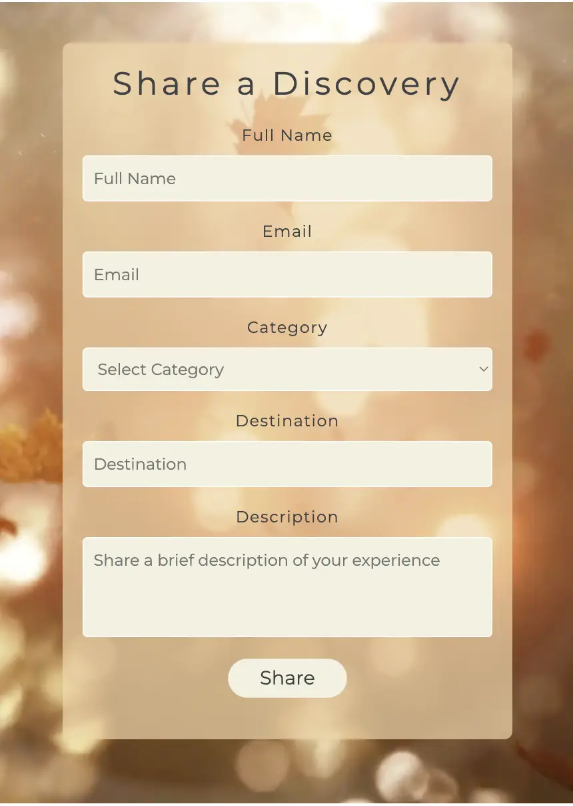

- The form section comprises of a background video of falling autumn leaves. The file size and type have been optimised for web whilst preserving quality.
- The form overlays the background with a translucent effect so that the 'falling leaves' can still be seen despite the overlay.
- the overlay although translucent does not get distracted by the video background which auto plays in the background, silently and on loop.
- The form includes data validation features such as 'required' fields and only accepts an email format in the respective input field. If any field is left blank and the user attempts to submit the form a browser prompt will notify the user that an input is required.
- On clicking the 'Share' button and passing data validation the entered data then gets 'stored' via a dummy link provided by Code Institute (the link opens in a new tab) - this is purely for testing purposes.
- The form includes UX enhancing visual feedback features like on hover/focus custom styling i.e. when a input field is hovered over or selected with the cursor, a black outline appears.

- This section encourages users to share their own content which will then be added to the relevant Category content section of the webpage. This feature will eventually form the backbone of content generation on the website.

### Footer

- The footer section includes icon links to Mind Flora's Social channels i.e. Facebook, X (previously Twitter), Instagram and Pinterest.
- These links open in a new tab to prevent users from unintentionally navigating away from the site.
- Appropriate use of Aria attributes have been used for Accessibility so that screen readers can work effectively on the icon based links.

### Potential Future developments

- Based on user feedback a mobile 'burger' menu may be implemented
- Enhanced form features such as ability for users to upload and share an image of destination and to be able to sign up to a newsletter.
- Creation of an ‘Explore’ section for users to locate Nature walks via an embedded map feature.
- As the pool of user-generated content grows a 'Search' feature will be introduced to effectively filter through the 'library' of content.
- In time the site will provide a feature to enable users to organise 'meetups' to explore the therapeutic benefits of nature as a group of like-minded fellow travel buddies. This will further enhance the benefit to mental wellbeing by combining in a social aspect as well.

## Testing

### User Story Testing

*As a site user I can view a list of travel destination posts so that I can browse the collection and select which post I want to view in further detail*

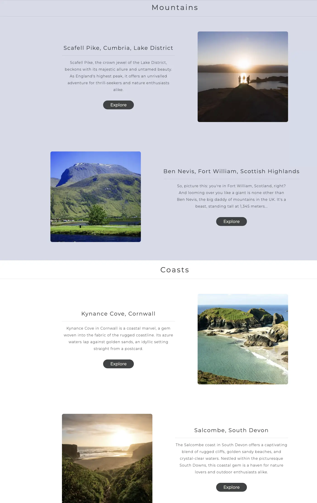

- On the landing page there is a section which displays a collection of posts.
- Each post consists of an image, title, a brief description and an 'Explore' button. On clicking the content / button, users can view the post in full detail.

*As a Site User I can click on a post so that I can read it in full detail*

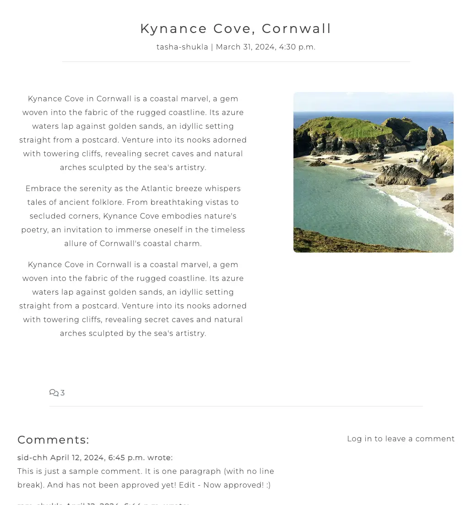

- Once a post is selected and clicked on the main page, the post can be viewed in full detail on the following (post details) page.

*As a Site User / Admin I can view comments on an individual post so that I can read the conversation*

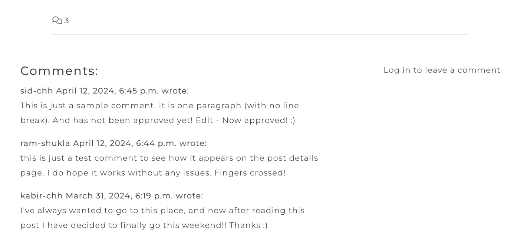

- As illustrated, users can view comments associated with a post on the respective post details page
- Admin users can view all comments associated with any post on the admin panel

*As a Site User I can register an account...*

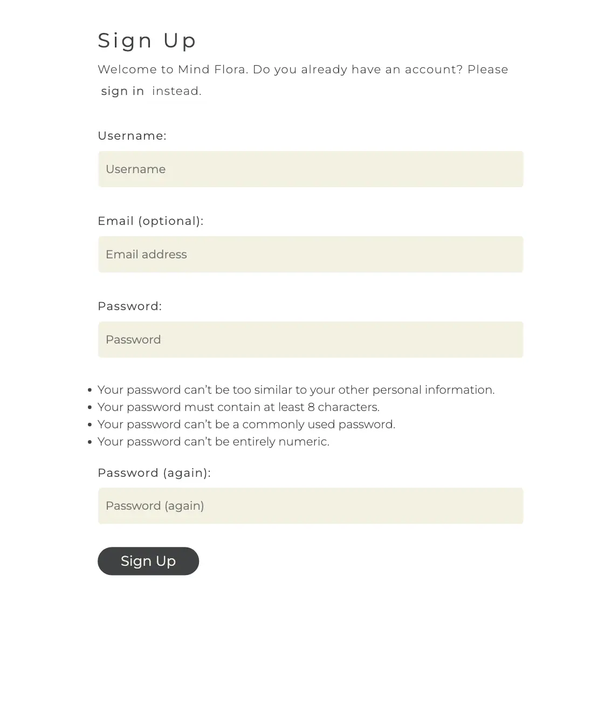

- On clicking the 'Signup' link in the nav bar, users are taken to the 'Sign Up' page where on, entering a username and password / (optional) email address, they can register and create an account 

*As a Site User I can leave comments on a post so that I can get involved in the conversation*

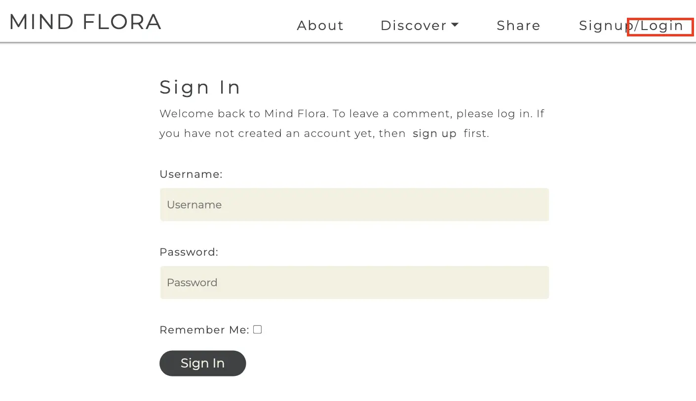
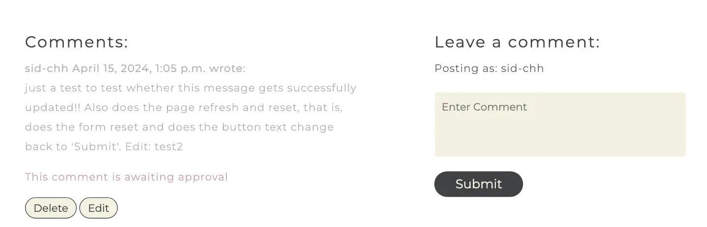

- On clicking the 'Login' link in the nav bar, registered users can login with thier username and password
- Once logged in, users can then leave a comment on a selected post on the 'post details' page in the 'Leave a comment' section
- Once a comment is submitted by the user it appears in the 'Comments' section (visible only to the commenter until it is approved by an admin)

*As a Site User I can modify or delete my comment on a post so that I can correct any errors or withdraw a comment from the conversation*

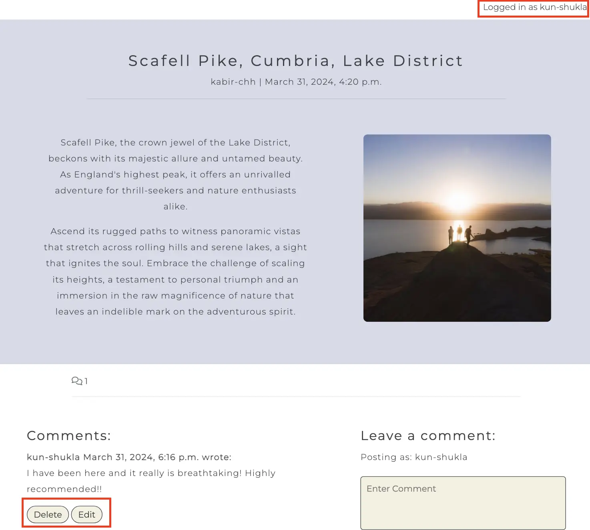

- A logged in user can edit/delete their comments for a particular post as illustrated.
- The 'edit'/'delete' buttons will appear against a comment only if the user that authored it is logged in. 

*As a Site Admin I can create, read, update and delete posts etc so that I can manage the site's content*

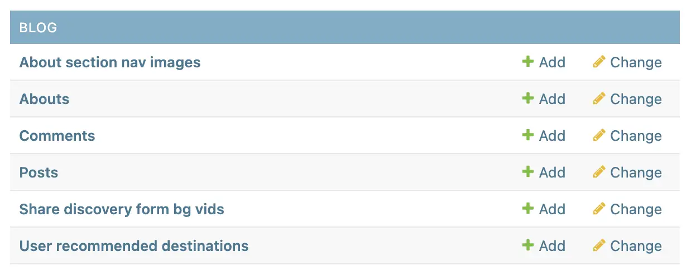

- Admins have full access to CRUD functionality via the admin panel for all posts, user comments, about content and 'user recommended destination' content (received via the 'Share a Discovery' form).    
- In addition, admins have the ability to manage other media content (both images and video) which make up the site - i.e. the circular nav images in the 'About' section as well as the the background video for the 'Share a Discovery' form (these are stored in the 'About section nav images' and 'Share discovery form bg vids' tables respectively)

*As a Site Admin I can create draft posts so that I can resume writing content later*

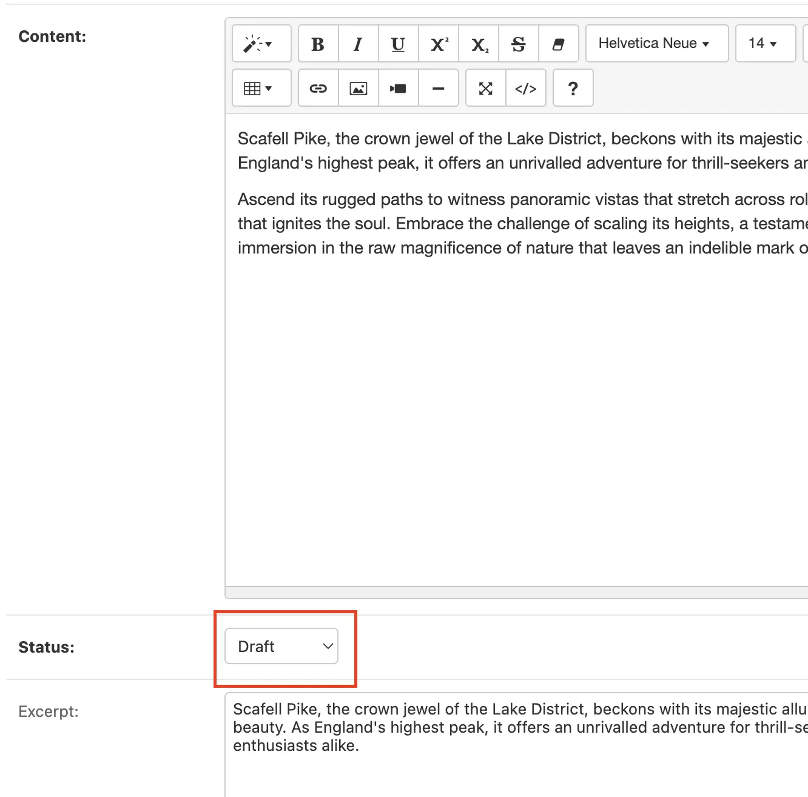

- Admins can create posts via the admin panel and choose to set the 'status' field to 'Draft' (which is the default value) so that they can come back to editing and completing the post at a later point.
- Draft posts are not displayed on the site until their 'status' is changed to 'Published' via the admin panel.

*As a Site Admin I can approve/disapprove comments so that I can filter out comments that I do not want on the site*

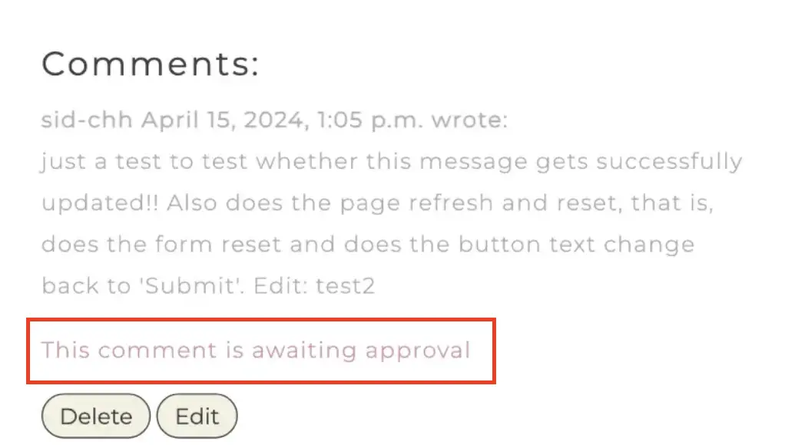
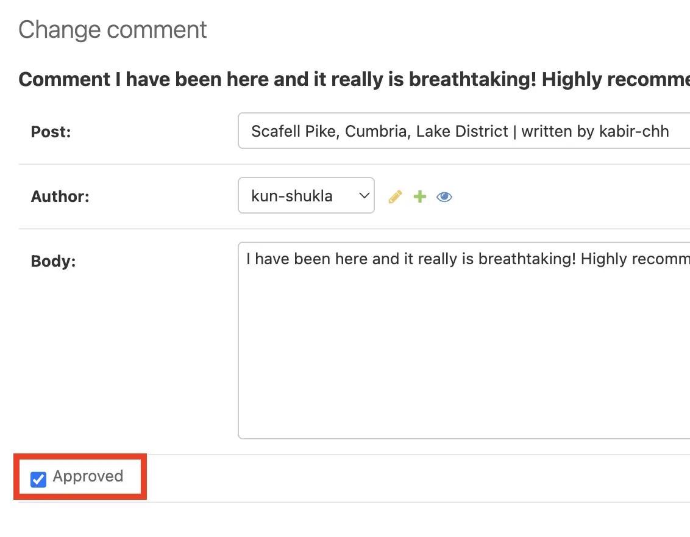

- When a comment is submitted by a user, they are notified that it is 'pending approval' (illustrated above). 
- The unapproved comment has a 'dulled out' appearance, and is only visible to other users, once it is reviewed and marked as approved by an admin - this is done by checking a checkbox field in the comment's respective entry in the Comments table (via the admin panel).

*As a site user I can suggest content for the website, via a form, so that I can contribute to the content on the site*

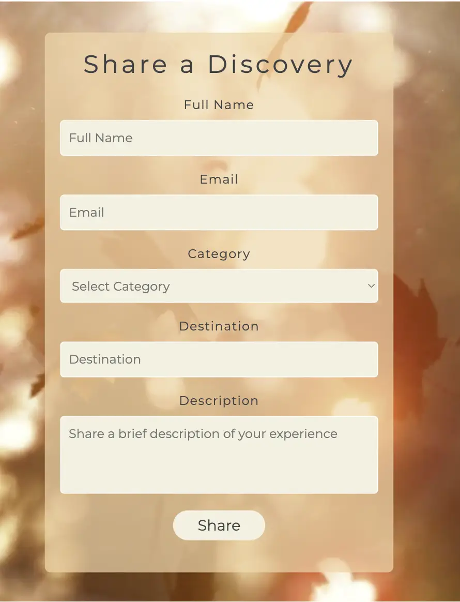

- Users can suggest content for the website via a 'Share a Discovery' form on the site's landing page.
- Users are required to fill up all fields. The 'Select a Category' field has preset options which corresponds to the site's 4 main post categories, i.e. Mountains, Coasts, Lakes and Forests. 

*As a Site Admin I can access/view messages sent by site users, so that I can review them*

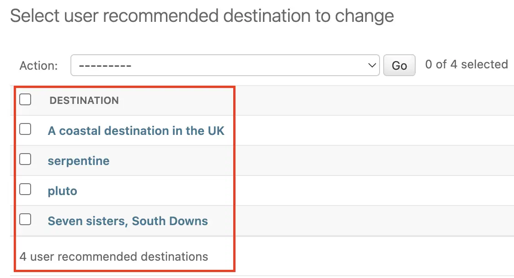

- Once a user submits a message (via the 'Share a Discovery' form), admins can view and review this content via the admin panel. These user messages are stored in the 'User recommended destinations' table in the database.

*As a Site admin I can mark user messages as "read" so that I can see how many I still need to review*

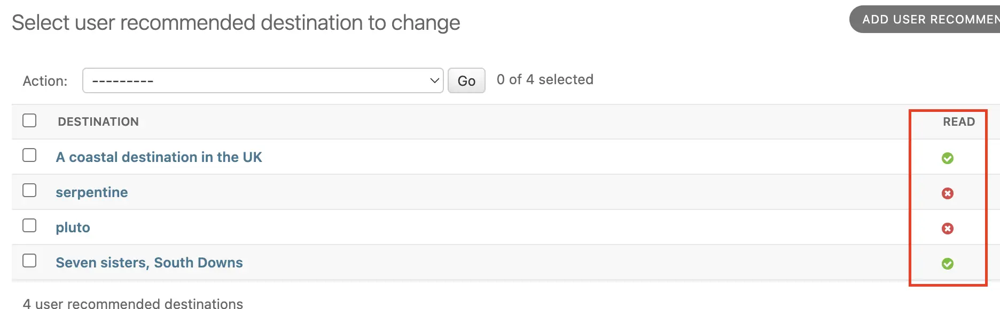

- The 'User recommended destinations' table has a 'read' checkbox field. This assists admins to review user submitted content by indicating how many messages are pending review.

### Automated testing
Django's test library was used to carry out a range of unit tests to check and verify expected performance of key indivdual components of the app's functionality. These unit tests (located in the *'test_views.py'* and *'test_forms.py'* files under the 'blog' app) specifically checked the following:
- GET request for the 'post detail' page (containing the comment form)
- GET request for the landing page containing the 'Share a Discovery' form
- POST request for posting a comment on a blog post to the database
- POST request for submitting user content via the 'Share a Discovery' form to the database
- Testing for server side validation of form data for both the Comment form on the 'Post details' page and the 'Share a Discovery' form on the landing page 

### Validator Testing

- #### HTML
  - No errors were returned when passing through the official W3C Markup Validator
    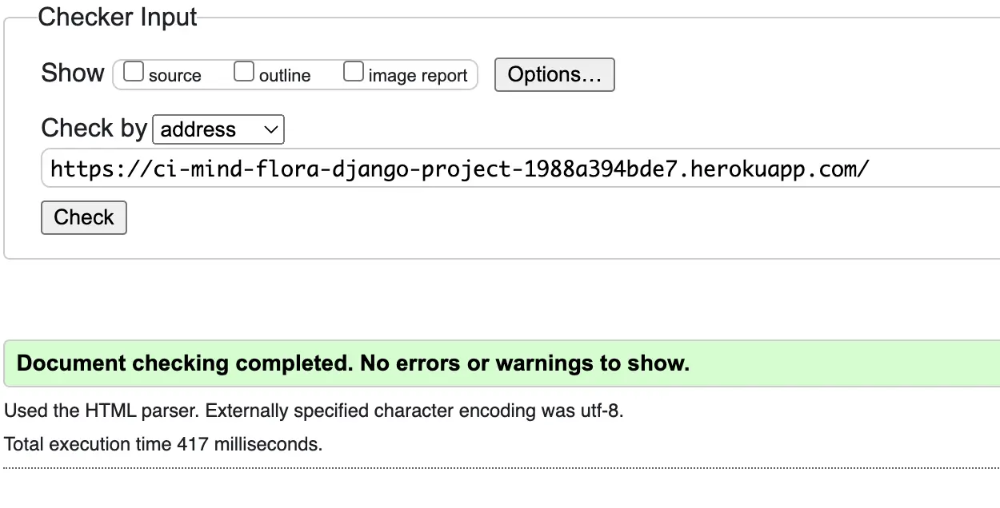
- #### CSS

  - No errors were found when passing through the official W3C CSS Validator
    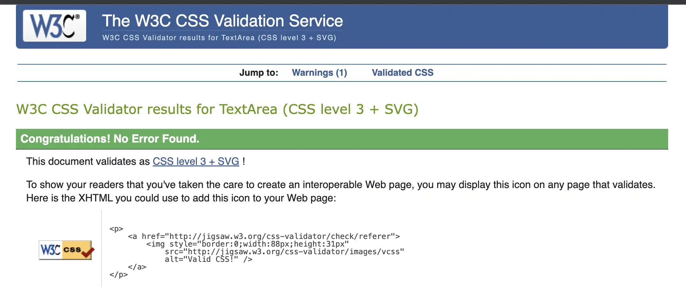

- #### Accessibility

  - The site achieved a Lighthouse (Chrome Dev tools) accessibility score of 94% which confirms that the colours and fonts chosen are easy to read and accessible
    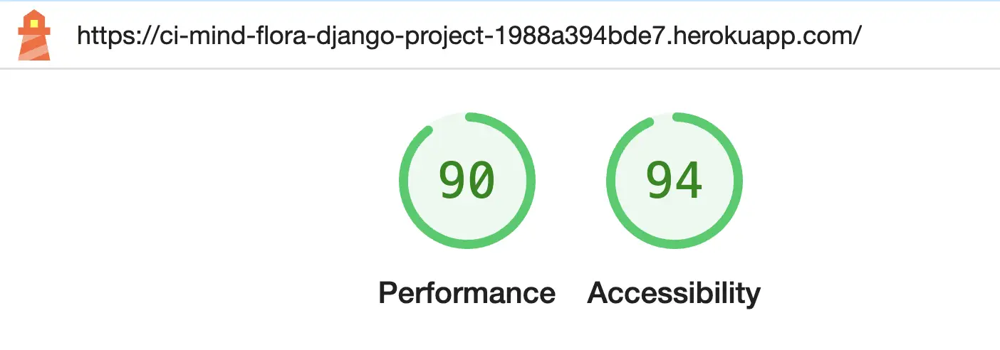

### Links Testing

- All navigation links tested thoroughly to ensure the user is directed to the correct section of the website at the appropriate 'anchor point'
- Social Media links in the page footer were tested manually to ensure there were no broken links and that they direct the user to the correct page.
- Also ensured appropriate usage of ARIA attributes and that external links opened in a new tab.

### Browser Testing

- The Webpage was tested on Google Chrome, Safari, Firefox and Microsoft Edge web browsers with no issues observed.

### Device Testing and responsiveness

- The website was viewed on a variety of devices such as Desktop, Laptop and mobile devices to ensure responsiveness across a range different screen sizes. The website performed as intended. Responsiveness was also checked extensively via Chrome developer tools across multiple device screen dimensions with no errors observed.

### Solved Bugs

#### 'Anchor point' issue when using page links to navigate to a particular section of the page

- As the Header containing the navbar is fixed I encountered an issue whereby page links to navigate to different sections of the site were 'arriving' at an 'anchor point' concealed by the navbar.
- To resolve this I used the 'scroll-padding-top' property to 'offset' the anchor points just enough to get the top of the targeted section to be fully visible just below the navbar.

#### Issue with achieving desired layout for the 'Categories Content' Section

- I made a design decision to go with Bootstrap for making the webpage fully responsive using the predefined 'grid layout' classes. However I discovered that I was unable to achieve the desired outcome for how I wanted the elements on the page to appear across the various screen size 'break points' (specifically for the 'Categories Content' section)
- My solution to this issue was to introduce flex styling and media queries to tweak the elements precisely and was therefore able to achieve the intended result.

### Known bugs

Issue observed while using the deployed site on iOS Chrome/Safari browsers, whereby the form section's background video does not immediately autoplay (despite being assigned the 'autoplay'/'mute' attributes). However, on visiting other sections and then revisiting the form section via the navbar, the video does usually start to play (though this can be erratic particulary on Chrome it seems).

## Languages Used

- Python
- HTML5
- CSS
- Javascript
- Bootstrap

### Frameworks / Libraries / Programs Used

- [Django](https://www.djangoproject.com/): Main python framework used in the development of this project
- [Django-allauth](https://django-allauth.readthedocs.io/en/latest/installation.html): authentication library used to create the user accounts
- [ElephantSQL](https://www.elephantsql.com): cloud-based PostgreSQL service was used as the database for this project.
- [Heroku](https://dashboard.heroku.com/login) - was used as the cloud based platform to deploy the site on.
- [Adobe photoshop](https://adobe.com/) - for compressing image file sizes without reducing quality, converting images/video to a web compatible format.
- [Website Mockup Generator](https://websitemockupgenerator.com/) - for the Readme file's hero image depicting a mock-up of how the web page looks like across different device screen sizes.
- [Balsamiq](https://balsamiq.com/) - for lo-fi wireframing
- [Bootstrap](https://getbootstrap.com/docs/4.6/getting-started/introduction/) - for implementing responsiveness and the navbar drop-down 'sub-menu' functionality
- [Chrome Dev Tools](https://developer.chrome.com/docs/devtools/) - Used for overall development and troubleshooting. As well as for testing responsiveness and site performance scores (Lighthouse)
- [Coolers](https://coolors.co) - for deciding on a compatible color theme.
- [Flaticon](https://www.flaticon.com) - for the site's favicon
- [Font Awesome](https://fontawesome.com/) - Used for Social Media icons in footer.
- [GitHub](https://github.com/) - Used for version control and deployment.
- [Google Fonts](https://fonts.google.com/) - Used to import custom fonts.
- [Visual Studio Code](https://code.visualstudio.com) - Used as the code editor.
- [W3C](https://www.w3.org/) - Used for HTML & CSS Validation.
- [PEP8 Online](http://pep8online.com/) - used to validate all the Python code
- [Jshint](https://jshint.com/) - used to validate javascript
- [Summernote](https://summernote.org/): A WYSIWYG editor used to enhance editing and browsing features in the Django admin panel.
- [pydotplus](https://pypi.org/project/pydotplus/): used for generating the Entity Relationship Diagram (ERD)

## Deployment - Heruko

To deploy this project to Heroku from its GitHub repository, the following steps were taken:
- Ensure in Django settings, DEBUG is False
- Go to the deploy tab on Heroku and connect to GitHub, then to the required repository. 
- Scroll to the bottom of the deploy page and click the 'Deploy Branch' button under the 'Manual Deploy' section. Manually deployed branches will need re-deploying each time the repo is updated.
- Click View to view the deployed site.

The site is now live and operational.

The live link can be found here - [Mind Flora](https://ci-mind-flora-django-project-1988a394bde7.hero)

## Credits

### Content

[ChatGPT](https://chat.openai.com) - used for generating ideas for the site's content.

### Media

All media files were sourced from the below websites and attributed to the following photographers:

- [Pexels](https://www.pexels.com/)
  - Marek Levak - Hero Image
  - Eberhard Grossgasteiger - 'Mountains' image in 'About' section
  - Unknown - 'Seven Sisters, England' - 'Coasts' image in 'About' section
  - Petra Ravensberg - 'A dirt road between trees' - 'Forests' image in 'About' section
  - All other images used for the 'Categories content' section of the website
- [Unsplash](https://unsplash.com)
  - Ben Griffiths - 'Sunrise at Ladybower Reservoir' - 'Lakes' image in 'About' section
- [Adobe stock](https://stock.adobe.com)
  - Whitcomberd - 'Hikers on Scafell Pike' image in Category content section (mountains)
  - WavebreakmediaMicro - 'Autumn leaves falling on the camera' video used as background for 'Form' section
- [Country File](https://www.countryfile.com/)
  - Unknown - 'Ullswater, Cumbria, Lake District' image in Category content section (Lakes)
- [Forestry England, UK](https://www.forestryengland.uk)
  - Unknown - 'Cannock Chase Forest' image in Category content section (Forests)
- [Much Better Adventures](www.muchbetteradventures.com)
  - Unknown - 'Kynance Cove in Cornwall' image in Category content section (Coasts)

### Online Resources Used

- [W3Schools](https://www.w3schools.com/)
- [Stack Overflow](https://stackoverflow.com/)
- [Django Docs](https://docs.djangoproject.com/en/4.0/)
- [Bootstrap 4.6 Docs](https://getbootstrap.com/docs/4.6/getting-started/introduction/)
- [Code Institute - 'I Think Therefore I Blog' walkthrough project](https://learn.codeinstitute.net/courses/course-v1:CodeInstitute+FSD101_WTS+2/courseware/56a2da0940b4411d8a38c2b093a22c60/4565659a34d648b8b8edd063c3182180/)

## Acknowledgments

- I found Code Institute's Love Running project and the Bootstrap module on building the 'Whiskey landing page' particularly helpful for refreshing my knowledge on how to use media queries effectively. Various elements of the site were inspired by the Love Running project such as the Footer section and Hero Image section. I followed the CI tutorials on Bootstrap to incorporate the 'Dropdown menu' component for the 'Discover' Nav link sub-menu.
- The design for the project was inspired by the work of a previous CI student. The way their website was designed was highly appealing to me and so I decided to base my own design layout on the same lines. I am therefore very grateful to this former student for their great work and for inspiring me with an idea for my own project. This is the deployed link for their project on Github - [Alison O'Keeffe](https://aliokeeffe.github.io/mindyoga/).
- This project is an extension of an earlier project which I created for my Project 1 submission (as part of the Full Stack Bootcamp provided by Code Institute). In the original project I made use of HTML/CSS only. This project mainly incorporates the addition of Django and Python to enable full stack functionality by introducing a backend database. The link for the original project can be found [here](https://kun-shukla.github.io/ci-p1-mind-flora/).
- This Readme file includes content from the original project (mentioned above) and has been updated accordingly to reflect the additional development during this project. The link to the repo for the original project can be found [here](https://github.com/kun-shukla/ci-p1-mind-flora)